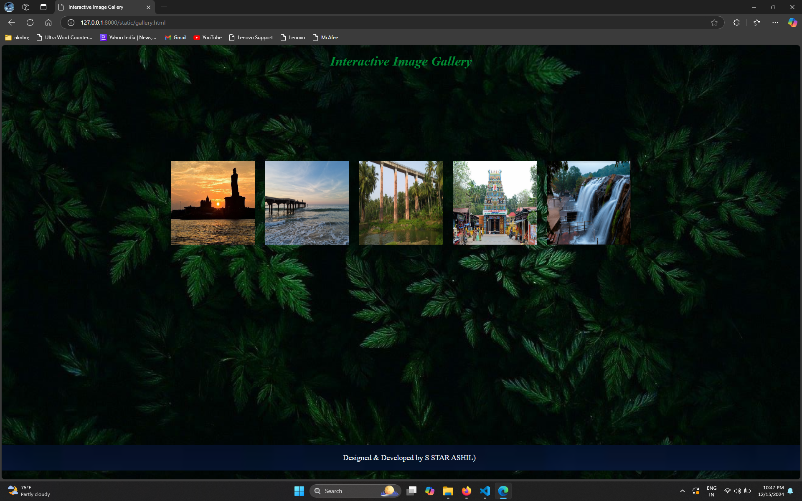
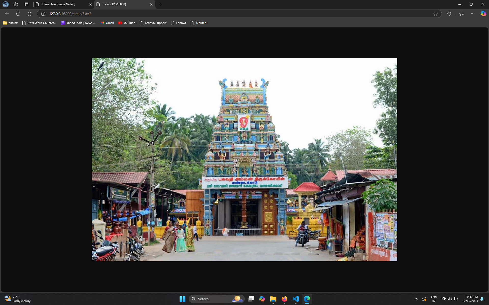

# Ex.08 Design of Interactive Image Gallery
## Date:14-12-2024

## AIM:
To design a web application for an inteactive image gallery with minimum five images.

## DESIGN STEPS:

### Step 1:
Clone the github repository and create Django admin interface.

### Step 2:
Change settings.py file to allow request from all hosts.

### Step 3:
Use CSS for positioning and styling.

### Step 4:
Write JavaScript program for implementing interactivity.

### Step 5:
Validate the HTML and CSS code.

### Step 6:
Publish the website in the given URL.

## PROGRAM :
Gallery.html
```
<html>
    <title >
        Interactive Image Gallery
    </title>
    <style>
        body {
            font-family: Lemon, lemon;
            display: flex;
            flex-direction: column;
            align-items: center;
            margin: 0;
            background-size: cover;
            background-image: url("bg.jpg");
        }

        h1 {
            margin-top: 20px;
            color: rgb(0, 139, 53);
            font-size: xx-large;
            font-style: italic;
        }

        .Gallery {
            display: flex;
            gap: 25px;
            max-width: 800px;
            margin-top: 200px;
            justify-content: center;
        }

        footer{
            bottom:2%;
            position: fixed;
            width:100%;
            background-image: url("https://encrypted-tbn0.gstatic.com/images?q=tbn:ANd9GcSm18eBadaqCzW5XTKA-c434AR5co6NgyoT9w&s");
            text-align: center;
            font-style: arial;
            color: aliceblue;
            left:0%;
            background-size:cover;
            padding:20px;
            font-size:18px;

        }
    </style>

    <body>
        <h1>
            Interactive Image Gallery</h1>
        <div class="Gallery">
            
            
            
            
            
            
        </div>

        <script>
            function openImage(src) {
                window.open(src, "_blank");
            }
        </script>
        <footer>
            Designed & Developed by S STAR ASHIL)
        </footer>
    </body>
</html>
```

## OUTPUT:





## RESULT:
The program for designing an interactive image gallery using HTML, CSS and JavaScript is executed successfully.
